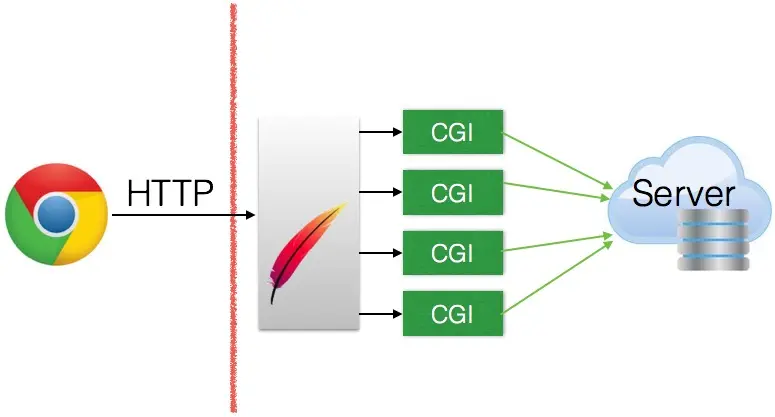

# CGI

CGI 即 Common Gateway Interface，译作“通用网关接口”。

## 1. Common

通用，是一个显著特征，虽然我们听说过Java的Servlet，Python的WSGI，但其实Java、Python都是支持CGI的，不仅如此，其他我们所熟知的语言也大都支持，理论上来说，所有支持标准输出，支持获取环境变量的编程语言都能用来编写CGI程序。

在HTML诞生之后，随着网络规模的发展，动态网站成为人们的主要诉求，CGI应运而生。第一个版本CGI由Perl语言编写的脚本，因此通常称之为“CGI脚本”。

其实呢，脚本（script）并不一定就是脚本语言编写的，脚本描述的是一类程序的特征：为了完成某一任务，用程序实现批量执行一组常用逻辑的组合。凡是符合这一特征的程序都可称作脚本。当然，脚本语言所编写的程序都可以称作脚本程序，并且其内部逻辑也早已变得并不简单。

## 2. Gateway

网关，通常，网关一词更多的是硬件层面的概念，但其实与CGI的网关二字之含义也是不谋而合的，称CGI为网关也不为过。

网关，更形象的叫法是“协议翻译机”。通常与网关输入输出两端通信使用的是不同协议。即一方是HTTP协议，另一方可能是其他协议，比如企业内部的自定义协议，CGI程序即是如此。

CGI程序通常部署到Web服务器（如Apache）上，Web服务器然后调用CGI程序，关于CGI程序到底如何从Web服务器中获得输入，详情于interface。

请注意区分Web Server和后台Server。

## 3. Interface

### 3.1 接口协议

接口，确切而言是“接口协议”，所谓协议，既是通信双方或多方都共识并遵守的一套规则，就像红灯停，绿灯行，只有都遵守这个规则，交通才不会出问题。实际上关键在于认知要一致，这个**共识**很重要。

例如TCP/IP这类二进制协议，协议内容的描述是某某字节是什么作用，其取值范围是什么，不同取值是什么含义，HTTP协议是字符协议，这类协议内容的描述就是第一行是什么，第二行是什么....，应该出现什么，表示什么意思。

其实不管是TCP/IP或是HTTP，都可以统称为“网络协议”，粗浅一点理解就是“描述报文内容详细语义的协议”，而“接口协议”却不然，他不会定义哪些字节该写什么，也不会定义字符内容规范，CGI其实是构架在HTTP协议之上的，描述的是另一个维度的共识标准。

### 3.2 输入、输出

回顾上面的图，Web服务器在接收到用户浏览器的HTTP请求，比如请求`http://baidu.com`。此时在Web服务器调用这个之前，会把各类HTTP请求中的信息以**环境变量**的方式写入OS，CGI程序本质上是OS上一个普通的可执行程序，它通过语言本身库函数来获取环境变量，从而获得数据输入。

除环境变量外，另外一个CGI程序获取数据的方式是标准输入（stdin）。如post请求一个CGI的URL，那么POST的数据，CGI是通过标准输入来获取的。

而CGI如何构造出数据（比如HTML页面）返回给浏览器呢？其实CGI本身只要向标准输出去写入数据即可，比如printf、cout、比如System.out.println，又比如print，echo等。因为Web服务器已经做了重定向，将标准输出重定向给Web服务器的与浏览器连接的socket。

此时要注意的是，不要以为返回HTML页面，那么直接输出一段HTML代码就可以了。此时CGI的输出承担的是HTTP协议的响应部分，因此HTTP响应报头也要自己标准输出出来。比如`cout<<"Context-Type:text/html\n\n"<<endl;`。

注意最后要有两个换行符，因为HTTP协议本身就是一个字符协议，它需要通过一个空行区来区分哪里是报头，哪里是实体，在两个换行符（即一个空行）之后就可以愉快的输出HTML（即实体部分）了。

CGI编写Web程序虽然看似解析组装等操作十分繁琐，但其实都有很多第三方封装来简化这些操作，高级语言的标准库基本都已经做了封装，而针对C++则有一个Cgicc。

### 4.硬伤

既然有这么多现成的库做了封装，那么理应用CGI编写Web的也不少才对，其实不然，这是因为CGI有一大硬伤。

每次HTTP请求CGI，Web服务器都有启动一个新的进程去执行这个CGI程序，即颇具Unix特色的fork-and-execute。当用户请求量大的时候，这个fork-and-execute的操作会严重拖慢Web服务器的性能。

FastCGI（FCGI）技术应运而生，简单来说，其本质就是一个常驻内存的进程池技术，由调度器负责将传递过来的CGI请求发送给处理CGI的handler进程来处理，在一个请求处理完成后，该处理进程不销毁，继续等待下一个请求的到来。

当然FCGI其实也并不是什么惊世骇俗的创意。**资源池是后台性能优化中常见的套路**。Java发明Servlet技术也是一种常驻内存的网关通信技术，只不过它采用的是多线程而非进程。

