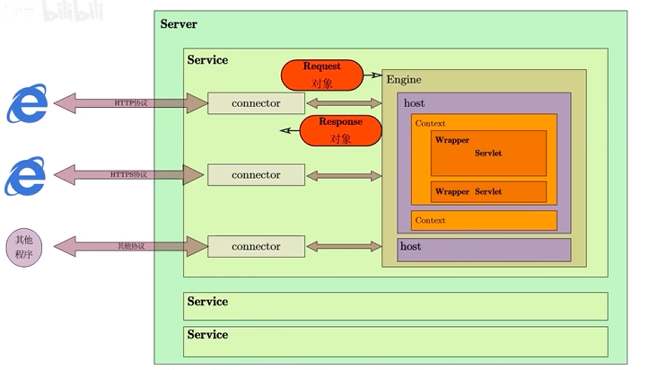

# Tomcat

## server.xml

全部内容于[server.xml](./server.xml)。

截取核心内容如下：

```xml
<?xml version="1.0" encoding="UTF-8"?>
<Server port="8005" shutdown="SHUTDOWN">

    <Service name="Catalina">
        <Connector port="8090" protocol="HTTP/1.1”
            connectionTimeout="20000" redirectPort="8443" />
        
        <Engine name="Catalina" defaultHost="localhost">

            <Host name="localhost" appBase="webapps"
                unpackWARs="true" autoDeploy="true">
            </Host>

        </Engin>
    <Service>
<Server>

```

可以了解到这是一个树形结构，Server就是Tomcat所对应的类，只会被实例化一次，Server节点下面可以包含多个Service节点，但是通常我们只有一个。顾名思义，Service这个类的作用就是对外提供服务，Service内部又包含一组连接器（Connector）和一个引擎（Engine），连接器负责通信，引擎负责请求的处理。

在server.xml配置文件当中需要指定连接器的监听端口，以及所采用的通信协议，默认情况下采用HTTP协议的连接器监听端口是80号端口，HTTPS是443端口。

### connector

1. 监听网络端口
2. 接收网络请求
3. 读取请求中的网络字节流
4. 将请求字节流转换成request对象
5. 调用Servlet容器（也就是Engine），获取response对象
6. 将response对象转换成响应字节流
7. 将响应字节流发给浏览器

### Engine

引擎是一个容器，它里面包含一个或者多个host对象，也即是虚拟主机。在配置文件中应指定虚拟主机的主机名（name），以及它的内容所存放的文件夹（appBase）。

#### Context

一台虚拟主机（Host），通常又挂着多个应用，一个应用对应一个Context对象。在配置文件当中需要将应用作为主机的子节点。有两个关键参数，一个是docBase，它的值应该是应用文件夹所在的物理地址；还有一个是path，它对应的是应用所对应的URL地址。

通常一个应用又包含了多个不同的servlet，每一个servlet可以有一个或多个实例。同一个servlet的实例被放在容器wrapper中进行管理。

